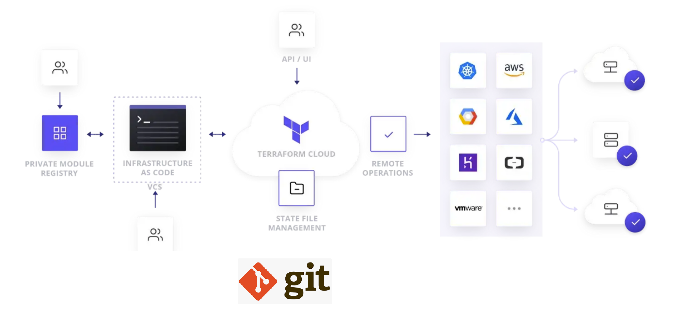
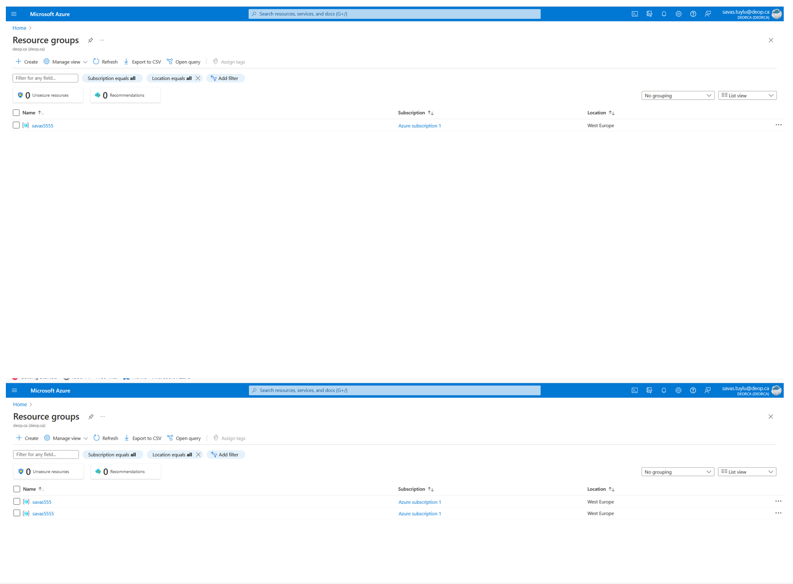
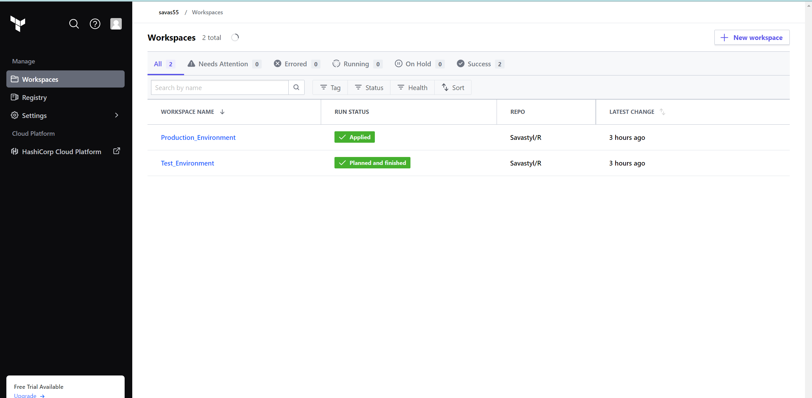
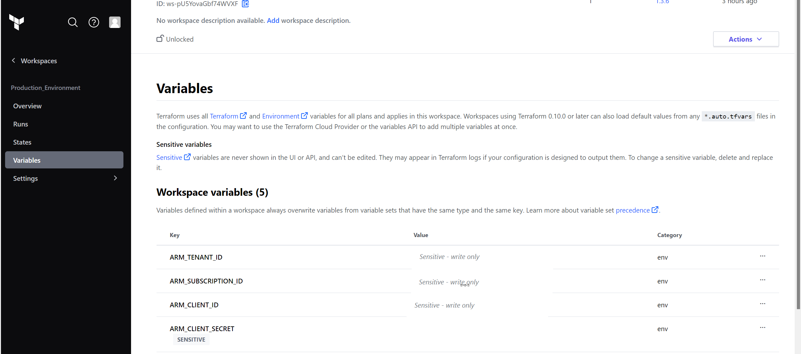

# Deployment of Azure Resources through Terraform Cloud

+ Terraform Cloud, you can use the web-based interface to create and manage your resources, and the platform will handle the authentication and execution of your Terraform code for you.

+ Configure your Azure credentials in Terraform Cloud. You can do this by setting the **ARM_CLIENT_ID** , **ARM_CLIENT_SECRET** , **ARM_TENANT_ID** , and **ARM_SUBSCRIPTION_ID** variables or additional Terraform variables in your Terraform configuration file, or by using a service principal authentication file.

+ Git can be used to track changes to your Terraform Cloud configuration files and collaborate with other team members.

## To deploy resources using VS Code, GIT, Terraform Cloud and Azure (or other clouds).

## Resource Groups Deployment

## Terraform Cloud View

## Variables in Terraform Cloud
